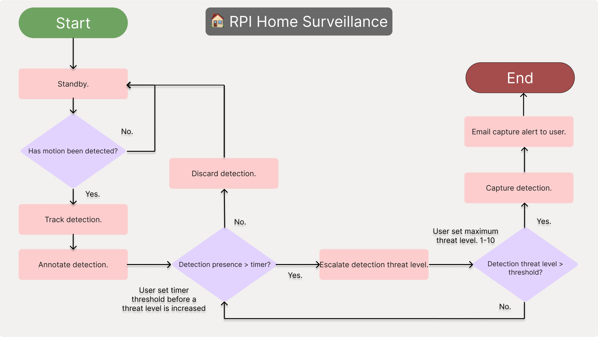

# 🏠-RPI-Home-Security-Project

This project is currently under development and visible for demonstration purposes only. Further documentation  
will be provided as features are implemented.  

The mission is to provide an **accessible, customizable home security system** leveraging a Raspberry Pi.

This system processes motion detected, tracks and annotates these detections whilst giving users access and control through a Flask web server.

Once a valid detection is considered a threat. Users are notified through email with the capture available for access which should assist in later follow ups.

This is a reattempt at my idea for **accessible** home surveillance where the user is in **full control**.

## 📖 Table of Contents

---
1. [Flowcharts](#-flowcharts)
2. [Features](#-features)
3. [Prerequisites](#-prerequisites)
4. [Setup](#-setup)
5. [Configuration](#️-configuration)
6. [RunningTheProject](#️-run)
---

## 📊 Flowcharts

This flowchart details the systems proprietary logic, an attempt to mitigate false positives in busy, urban environments, considering lingering detections as potential threats.

## 🚀 Features

    ✔️ Motion Detection
    ✔️ Object Detection
    ✔️ Object Tracking
    ✔️ Customizable Settings
    ✔️ Locally hosted web server

## 🔧 Prerequisites

    * In order for this project to be viable, these components are required. 

    ### Hardware:

        Raspberry Pi (--Model 4B onwards)
        Pi Camera Module V2
        MicroSD (--min 16GB, --class 10)
        Internet Connection

    ### Software:

        Raspberry Pi OS (Insert tutorial link here.)
        Python 3.11
        Gmail Account (Required for email alerts)

## 🛠 Setup

Clone this git repo with:

    * git clone https://github.com/MichaelwaveOfficial/rpi_security_system_rebuild_25.git

    * cd project folder

Install dependencies:

    * pip install -r requirements.txt 

## ⚙️ Configuration

    * setting up email alerts.

    In order for the email alerts to work, you will need to generate an app password from your google account
    which will 

    1. Log into current/create a new gmail account.

    2. Find Security > App Passwords.

    3. generate app password in settings, keep that safe!

Update the .env file with your credentials:

    * APP_EMAIL=example@gmail.com
    * APP_PASSWORD=your-generated-app-password
    * TARGET_EMAIL=recipient@email.com

## ▶️ Run

Run the project:

    * python main.py
